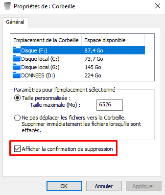
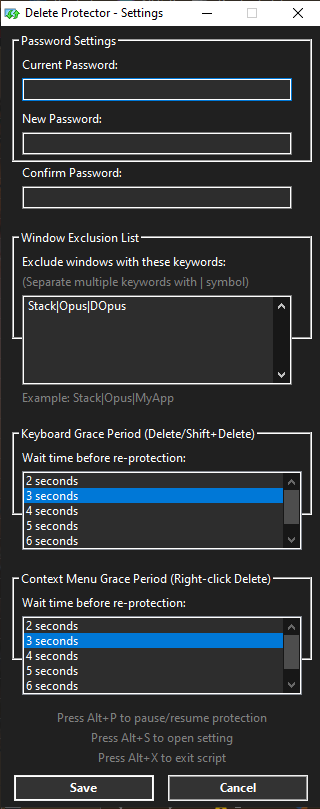
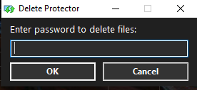
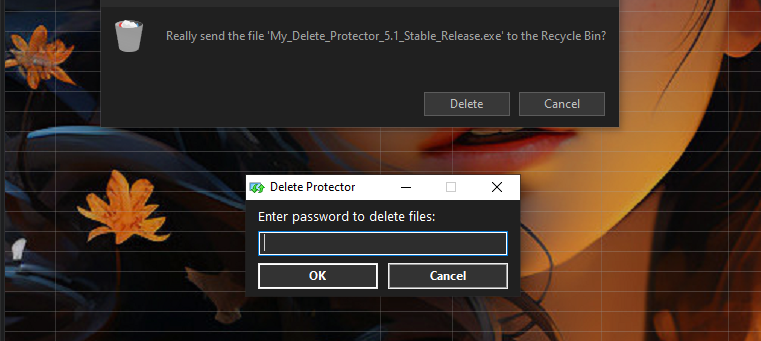
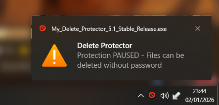
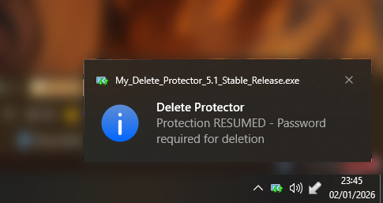
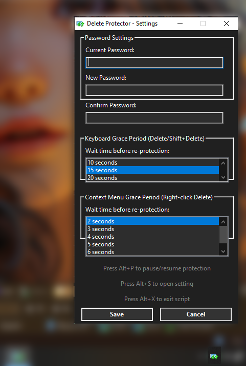
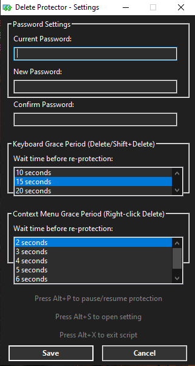

# 🛡️ Delete Protector - Advanced File Deletion Security


---

## ⚠️ Important: Understanding Delete Protector

---

### 🎯 What This Tool Does (And Doesn't Do)

**Delete Protector is designed to prevent ACCIDENTAL file deletions, NOT to provide security protection.**

---

### How It Works:

- Intercepts **Delete** and **Shift+Delete** keyboard shortcuts
- Detects **right-click context menu delete** operations
- Requires password authentication before allowing deletion

---

### What It Does NOT Protect Against:

- Command-line deletions (CMD, PowerShell, batch scripts)
- File deletions by other programs/applications
- Deletions made by users with administrator privileges via other methods
- Direct file manipulation through code or scripts
- Malware or ransomware attacks

---

**🔒 This tool protects HOTKEYS and DIALOGS, not the files themselves.**

Anyone with sufficient knowledge can bypass this protection by:

- Ending the process via Task Manager
- Using command-line tools (del, rm, etc.)
- Using file management tools that don't trigger standard Windows delete dialogs
- Deleting files programmatically

---

**💡 Think of this as a "speed bump" that makes you think twice before deleting, not a security vault.**

---

## 📦 Two Editions: Choose Your Protection Level

---

### 🟢 Definitive Edition - User-Friendly Protection

**Best for:** Personal computers, solo users, home environments

---

#### Features:

- Password protection for delete operations (Delete/Shift+Delete/Context Menu)
- **Plain text password storage** - easily recoverable by opening `DeleteProtector.ini`
- **No password required** to exit, pause, or access settings
- Dialog Window Exclusion List (exclude specific file manager dialogs by keyword)
- Separate grace periods for keyboard and context menu operations
- Simple and lightweight

---

#### Security Level: 🔓 Low

- Password is stored in plain text in the config file
- Anyone can open settings, pause protection, or exit without authentication
- Easy to recover if you forget your password (just check the .ini file)

---

#### Privacy Tip:

If you want to hide the password from casual observers:

- Enable stealth mode (hide tray icon) - instructions in README
- Rename the script to something innocuous
- Use third-party tools to hide the tray icon

---

#### ⚠️ Dialog Exclusion Limitation:

The Dialog Window Exclusion List (e.g., `Stack|Opus|DOpus`) only excludes delete confirmation dialogs for those applications. However, **keyboard shortcuts (Delete/Shift+Delete) will still work without password in those apps** because the exclusion is checked when the dialog appears. This means someone could:

1. Open an excluded application (like Directory Opus)
2. Use Delete/Shift+Delete keys to bypass password protection entirely

If you need protection in all scenarios, consider using the Ultimate Edition.

---

### 🔴 Ultimate Edition V2026 - Maximum Protection

**Best for:** Shared computers, family PCs, workplace machines, multi-user environments

---

#### Features:

- Password protection for delete operations (Delete/Shift+Delete/Context Menu)
- **DPAPI encrypted password** - Windows Data Protection API (can only be decrypted by your Windows user account)
- **Password required** to exit, pause, or access settings (prevents tampering)
- **SafeList Applications** - whitelist trusted apps (e.g., VS Code, Notepad++) that completely bypass ALL protections
- Dialog Window Exclusion List (exclude specific dialogs while keeping keyboard protection active)
- Separate grace periods for keyboard and context menu operations
- Enhanced security for shared environments

---

#### Security Level: 🔒 Medium-High

- Password is encrypted and bound to your Windows user account
- Cannot easily view password by opening config file
- Others cannot disable protection without your password
- Prevents casual tampering by family members, coworkers, or guests

---

#### ⚠️ Recovery Limitation:

If you forget your password, you'll need to:

1. End the process via Task Manager
2. Delete `DeleteProtector.ini` to reset to default password (`admin123`)
3. Or manually edit the registry/config (advanced users)

---

#### 🎯 SafeList vs Dialog Exclusion:

**SafeList Applications:**
- Completely bypasses ALL protections for specific apps
- Keyboard protection: ❌ Disabled (Delete/Shift+Delete work freely)
- Context menu protection: ❌ Disabled (right-click delete works freely)
- Use case: Development tools where you frequently manage files (VS Code, Notepad++, IDEs)
- Example: `notepad++.exe|Code.exe|devenv.exe`

**Dialog Window Exclusion:**
- Only skips password for specific delete dialogs
- Keyboard protection: ✅ Still active (password required)
- Context menu protection: ❌ Disabled (dialog is excluded)
- Use case: File managers with their own confirmation (Directory Opus, Total Commander)
- Example: `Stack|Opus|DOpus`

---

#### 💡 Recommendation:

- Use **SafeList** for apps you completely trust and use heavily
- Use **Dialog Exclusion** for file managers that have their own delete confirmations

---

## 🆚 Quick Comparison

---

**Delete operation protection:**
- Definitive Edition: ✅ Yes
- Ultimate Edition V2026: ✅ Yes

**Password storage:**
- Definitive Edition: Plain text (.ini file)
- Ultimate Edition V2026: DPAPI encrypted

**Settings access:**
- Definitive Edition: 🔓 No password needed
- Ultimate Edition V2026: 🔒 Password required

**Exit protection:**
- Definitive Edition: 🔓 No password needed
- Ultimate Edition V2026: 🔒 Password required

**Pause protection:**
- Definitive Edition: 🔓 No password needed
- Ultimate Edition V2026: 🔒 Password required

**SafeList apps:**
- Definitive Edition: ❌ No
- Ultimate Edition V2026: ✅ Yes

**Dialog exclusion:**
- Definitive Edition: ✅ Yes
- Ultimate Edition V2026: ✅ Yes

**Password recovery:**
- Definitive Edition: ✅ Easy (check .ini file)
- Ultimate Edition V2026: ⚠️ Difficult (need to reset)

**Best for:**
- Definitive Edition: Personal use, solo users
- Ultimate Edition V2026: Shared computers, families

**Security level:**
- Definitive Edition: 🔓 Low (convenience-focused)
- Ultimate Edition V2026: 🔒 Medium-High (protection-focused)

---

## ✅ Recommended Use Cases

---

### Use Delete Protector when you want to:

- Prevent accidentally hitting Delete/Shift+Delete during work
- Add a "Are you sure?" moment before deleting important files
- Protect against impulsive deletions you might regret
- Prevent children or guests from accidentally deleting files
- Add an extra layer of friction to the delete process

---

### DO NOT rely on Delete Protector for:

- Protecting sensitive or confidential data (use encryption instead)
- Preventing determined malicious actors from deleting files
- Replacing proper backup solutions (ALWAYS back up important files!)
- Securing files from ransomware or malware
- Enterprise-level data protection

---

## 🛡️ Remember: This is NOT a Replacement for Backups!

---

**The Windows Recycle Bin is your first line of defense. Delete Protector is your second.**

Always maintain proper backups of important files using:

- Cloud storage (OneDrive, Google Drive, Dropbox)
- External hard drives
- Windows File History
- Professional backup solutions

Delete Protector simply makes you **think twice** before deleting. It won't protect you from everything, but it will protect you from yourself! 😊

---

**Choose the edition that matches your needs and trust level! 🎯**

---


# Delete Protector - Definitive Edition v5.5

## 🎯 Overview
A powerful AutoHotkey script that protects your files from accidental deletion by requiring password authentication before any delete operation. Features a sleek dark-themed interface, configurable grace periods, and smart window exclusion system.

## ✨ What's New in Definitive Edition v5.5

### 🔧 Major Bug Fixes
- **Fixed Keyboard Protection Grace Period** - Resolved critical issue where keyboard shortcuts (Delete/Shift+Delete) would bypass password protection during grace period
- **Separate But Unified Grace Periods** - Both keyboard and context menu grace periods now use the same sensible 2-7 second range (previously keyboard had illogical 15-25 second range)
- **Dark Theme Improvements** - Enhanced visual consistency across all UI elements

### 🚀 Key Features

#### Password Protection System
- Intercepts **ALL** delete operations:
  - `Delete` key
  - `Shift+Delete` (permanent delete)
  - Right-click context menu delete
  - Automatic detection of Windows delete confirmation dialogs
- Default password: `admin123` (changeable in settings)
- Dark-themed password prompt for better UX

#### Smart Grace Period System
**How it works:**
- After successful password entry, a temporary grace period prevents annoying double-prompts
- **Keyboard Grace Period** (2-7s): Only disables *dialog detection* - keyboard shortcuts STILL require password
- **Context Menu Grace Period** (2-7s): Allows the Windows delete dialog to proceed without re-prompting
- **Recommended: 2-3 seconds** (default: 3s) - Fast enough to be unnoticeable during normal workflow

**Why separate timers?**
- Flexibility: Customize each deletion method independently
- Consistency: Both now use the same 2-7 second range
- Security: Short periods prevent abuse while maintaining protection

#### Window Exclusion List
Exclude specific applications from delete protection - perfect for file managers with built-in protections.

**How it works:**
- Add keywords separated by `|` symbol (e.g., `Stack|Opus|DOpus`)
- Case-insensitive matching
- Checks window titles before triggering protection

**⚠️ IMPORTANT - Directory Opus Users:**
- Adding `Opus` or `DOpus` to exclusion list will **disable context menu delete protection** in Directory Opus
- This is intentional - Directory Opus has its own confirmation system
- Keyboard shortcuts (Delete/Shift+Delete) will still be protected
- Test your preferred workflow before relying on it

**Default exclusions:** `Stack|Opus|DOpus`

#### Pause/Resume Feature
- **Alt+P**: Toggle protection on/off
- System tray icon changes to indicate status:
  - 🛡️ Shield icon = Active protection
  - ⚠️ Warning icon = Paused (files can be deleted without password)
- Useful for bulk delete operations or temporary file management

#### Multi-Language Support
Automatically detects and protects delete dialogs in:
- English: "Delete File", "Delete Folder", "Delete Multiple Items", "Confirm File Delete"
- French: "Supprimer le fichier", "Supprimer le dossier", "Supprimer plusieurs éléments"
- Fallback detection for other language variants containing "Delete", "Confirm", "Supprimer", or "Confirmer"

## 📋 Installation

1. Download `Delete_Protector_Definitive_Edition.ahk`
2. Install [AutoHotkey v1.1](https://www.autohotkey.com/) if not already installed
3. Double-click the script to run
4. Optional: Compile to `.exe` or add to Windows startup

## ⚙️ Configuration

### Settings Panel (Alt+S)

**Password Settings:**
- Change password (requires current password verification)
- All password fields must be filled to update

**Window Exclusion List:**
- Add application keywords to exclude from protection
- Separate multiple keywords with `|` (e.g., `Stack|Opus|MyApp|Firefox`)
- Example use cases:
  - File managers with built-in delete confirmations
  - Development tools with safe delete features
  - Applications you fully trust

**Grace Period Settings:**
- **Keyboard Grace Period**: 2-7 seconds (default: 3s)
  - Recommended: 2-3 seconds for seamless experience
  - Prevents dialog re-detection after keyboard delete
  - Note: Keyboard shortcuts still require password during grace period
  
- **Context Menu Grace Period**: 2-7 seconds (default: 3s)
  - Recommended: 2-3 seconds
  - Allows Windows delete dialog to proceed after password entry
  - Prevents annoying double-prompts

### Keyboard Shortcuts
- **Alt+P**: Pause/Resume protection
- **Alt+S**: Open settings
- **Alt+X**: Exit script
- **Delete**: Triggers password prompt (unless paused/excluded)
- **Shift+Delete**: Triggers password prompt (unless paused/excluded)

## 🔒 Security Features

1. **Always-On Keyboard Protection**: Delete keys require password even during grace periods
2. **Dialog Interception**: Freezes Windows delete dialogs until password is verified
3. **Multi-Method Coverage**: Protects against all common deletion methods
4. **Configurable Exclusions**: Maintain protection while allowing trusted apps to work normally

## 🛠️ Technical Details

- **Language**: AutoHotkey v1.1
- **Config File**: `DeleteProtector.ini` (auto-created in script directory)
- **System Tray Integration**: Minimal, non-intrusive operation
- **Dialog Detection**: 50ms polling rate for responsive protection
- **Memory**: Lightweight, minimal system resource usage

## 💡 Usage Tips

1. **First-time setup**: Change default password immediately via Alt+S
2. **Optimal grace periods**: Start with 3 seconds, reduce to 2 if comfortable
3. **Exclusion list**: Only add applications you completely trust
4. **Bulk operations**: Use Alt+P to pause protection temporarily
5. **Testing**: Always test exclusion list with non-critical files first

## 📝 Configuration File Example

```ini
[Settings]
Password=YourSecurePassword
KeyboardGracePeriod=3
ContextMenuGracePeriod=3
ExclusionList=Stack|Opus|DOpus

---

## 🔒 Advanced Setup: Stealth Mode

For enhanced security, you can hide the system tray icon while keeping the script running:

### **Hiding the Tray Icon**

Add this line near the top of the script (after the tray menu creation):
```autohotkey
Menu, Tray, NoIcon
```

**Insert it here:**
```autohotkey
Menu, Tray, Icon, shell32.dll, 47
Menu, Tray, NoIcon  ; <-- Add this line for stealth mode
```

### **Using Stealth Mode**
Once the tray icon is hidden:
- **Access Settings**: Press `Alt+S` (works even without tray icon)
- **Pause/Resume**: Press `Alt+P`
- **Exit Script**: Press `Alt+X`
- All hotkeys remain fully functional

⚠️ **Important**: Make sure you remember these hotkeys before hiding the tray icon!

---

## ⌨️ Complete Hotkey Reference

| Hotkey | Function | Description |
|--------|----------|-------------|
| `Alt+P` | Pause/Resume | Toggle protection on/off instantly |
| `Alt+S` | Settings | Open settings panel to change password and grace periods |
| `Alt+X` | Exit | Close Delete Protector completely |
| `Delete` | Protected Delete | Intercepts Delete key, requires password |
| `Shift+Delete` | Protected Permanent Delete | Intercepts Shift+Delete, requires password |

💡 **Tip**: All hotkeys work whether the tray icon is visible or hidden!

---

## 📁 File Structure

```
DeleteProtector/
│
├── Delete_Protector_Definitive_Edition.ahk    # Main script file
└── DeleteProtector.ini

```

### **Configuration File Contents**
```ini
[Settings]
Password=admin123
KeyboardGracePeriod=25
ContextMenuGracePeriod=3
```

---

## 🎯 Recommended Configuration

For optimal security and usability:

| Setting | Recommended Value | Reason |
|---------|------------------|---------|
| **Context Menu Grace Period** | **2-3 seconds** ⭐ | Provides real-time protection while giving enough time to interact with the delete dialog |
| **Keyboard Grace Period** | 2-3 seconds | Provides real-time protection |
| **Password** | Strong custom password | Change from default `admin123` immediately |
| **Startup** | Enabled | Ensures continuous protection |

---

## 🛠️ Technical Details

### **Protection Methods**
- **Keyboard Hook**: Intercepts global `Delete` and `Shift+Delete` keypresses
- **Dialog Monitoring**: Active polling (50ms intervals) for Windows delete confirmation dialogs
- **Window Freezing**: Temporarily disables delete dialogs using Windows API
- **Multi-language Detection**: Recognizes delete dialogs in multiple languages

### **Supported Windows Dialog Classes**
- `#32770` (Standard Windows Dialog)
- Delete File, Delete Folder, Delete Multiple Items
- Confirm File Delete
- Multi-language variants (English, French)

### **Requirements**
- Windows 7/8/10/11
- AutoHotkey v1.1+
- Administrator privileges (recommended for full protection)

---

## 🔐 Security Notes

✅ **What This Protects Against:**
- Accidental deletions from keyboard shortcuts
- Unauthorized file deletion attempts
- Context menu delete operations
- Batch deletion mistakes

⚠️ **What This Does NOT Protect Against:**
- Deletions made by other programs/scripts with elevated privileges
- Command-line deletions (CMD, PowerShell)
- File deletions from applications that bypass Windows Explorer
- System-level operations

💡 **Best Practices:**
- Change the default password immediately after first run
- Use a strong, unique password
- Set Context Menu Grace Period to 2-3 seconds for maximum security
- Keep the script running at all times (add to startup)
- Regularly back up important files (this is an additional layer, not a replacement for backups)

---

## 📜 License

This project is licensed under the **MIT License** - feel free to use, modify, and distribute!

---

## 👨‍💻 Author

**AndrianAngel** - [GitHub Profile](https://github.com/AndrianAngel)

---

## 🤝 Contributing

Contributions, issues, and feature requests are welcome!

---

## ⭐ Support

If you find Delete Protector useful, please give it a star on GitHub! ⭐

---

## 📝 Version History

**v5.5 Definitive Edition** (03/01/2026)
* Fixed critical keyboard protection grace period bug
* Unified grace period ranges (2-7 seconds for both keyboard and context menu)
* Enhanced dark theme consistency
* Improved security: keyboard shortcuts now always require password during grace period


---

**🛡️ Stay Protected. Stay Secure. Delete with Confidence. 🛡️**

---

## 📸 Screenshots & Demo

### 🎯 **Requirement: Activate Delete Confirmation**

Before using Delete Protector, make sure to enable "Display delete confirmation dialog" in Windows File Explorer settings:



---

### ⚙️ **Settings Interface**

#### Main Settings Panel



---

### 🔐 **Password Prompt Examples**

#### Keyboard Delete Protection (Delete/Shift+Delete)


#### Context Menu Delete Protection (Right-Click Delete)


---

### ⏸️ **Protection Status Notifications**

#### Protection Paused


#### Protection Resumed


---

### 🎬 **Live Demo**

Watch Delete Protector in action:


---

**📺 [Watch Full Feature Walkthrough (2:45)](https://m.youtube.com/watch?v=9mtxVpCiEtw)** - Complete demonstration including:
- Keyboard shortcuts (Delete & Shift+Delete)
- Context menu protection
- Explorer & Directory Opus integration
- Recycle Bin operations
- Settings configuration
- And more!

---

# 📌 Delete Protector Ultimate Edition V2026

---

## 🌿 New Security Features 🌿

---

### ⭐🌸 DPAPI Password Encryption 🌸⭐

Your password is now encrypted using Windows Data Protection API (DPAPI), making it significantly more secure than plain text storage. The encrypted password is stored in the configuration file and can only be decrypted by your Windows user account.

---

### 🎯 Enhanced Password Protection

---

🔑🔒 Password authentication is now required for:

- Exiting the application (both via tray menu and Alt+X shortcut)
- Accessing settings (Alt+S shortcut or tray menu)
- Pausing/resuming protection (Alt+P shortcut or tray menu)

👉 This prevents unauthorized users from disabling or modifying the protection settings 👈.

---

### 📜 SafeList Applications

You can now whitelist specific applications (e.g. notepad++.exe, Code.exe, notepad.exe) that will completely bypass all password protections. When these applications are active, you can delete files freely without any password prompts.

---

### 👀 SafeList vs Dialog Exclusion

📌 SafeList Apps: Bypasses all protection (keyboard shortcuts and dialog detection) for trusted applications where accidental deletions are less likely.

📣 Dialog Exclusion: Only excludes specific dialog windows by keywords (e.g. Stack, Opus, DOpus) while keeping keyboard protection active.

---

⚠️ This dual-layer approach gives you precise control: use SafeList for development tools and text editors where you frequently manage files, and use Dialog Exclusion for specific file manager dialogs you want to skip.

---

🎁 🌱 Ultimate Edition V2026 Setting 🌱 🎁




---

🔒🔑 DPAPI Password Encryption Overview 🔑🔒




---
