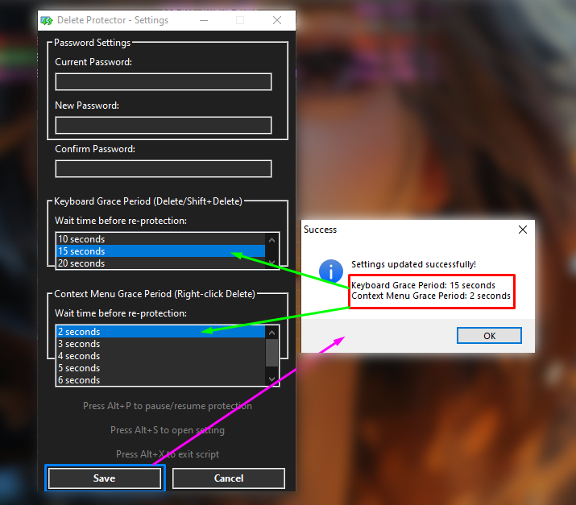

# 🛡️ Delete Protector - Advanced File Deletion Security


## 📋 Description

**Delete Protector** is a powerful AutoHotkey script that adds an extra layer of security to your file deletion operations on Windows. It intercepts all delete attempts—whether from keyboard shortcuts or context menu operations—and requires password authentication before allowing any files to be permanently deleted or moved to the Recycle Bin. Perfect for preventing accidental deletions, protecting important files from unauthorized removal, or adding an extra security measure to your system.

---

## ✨ Key Features

### 🔐 **Password-Protected Deletion**
- **Master Password System**: All delete operations require password authentication before execution
- **Default Password**: `admin123` (customizable in settings)
- **Secure Authentication**: Password is masked during entry and stored in a local configuration file
- **Custom Password Changes**: Change your password anytime through the settings interface with old password verification

### ⌨️ **Keyboard Shortcut Protection**
- **Delete Key Interception**: Pressing `Delete` triggers a password prompt before moving files to Recycle Bin
- **Shift+Delete Interception**: Pressing `Shift+Delete` requires password authentication before permanent deletion
- **Smart Grace Period**: After successful authentication, keyboard shortcuts work normally for a configurable period (10-25 seconds)
- **Prevents Accidental Deletions**: No more accidental file removals from keyboard mishaps

### 🖱️ **Context Menu Protection**
- **Right-Click Delete Monitoring**: Automatically detects Windows delete confirmation dialogs triggered by right-click menu
- **Dialog Freezing Technology**: Freezes the native Windows delete dialog until password is verified
- **Multi-Language Support**: Detects delete dialogs in English and French (expandable to other languages)
- **Seamless Integration**: Works with all Windows delete confirmation dialogs including:
  - Single file deletion
  - Folder deletion
  - Multiple items deletion
  - Permanent deletion confirmations

### ⏱️ **Dual Grace Period System**
Delete Protector features two independent grace period mechanisms for optimal user experience:

#### **Keyboard Grace Period (10-25 seconds)**
- Applies to `Delete` and `Shift+Delete` keyboard shortcuts
- After successful password entry, keyboard delete operations work freely for the selected duration
- Configurable options: 10, 15, 20, or 25 seconds
- Default: 25 seconds
- **Use Case**: Ideal for batch deletions using keyboard shortcuts

#### **Context Menu Grace Period (2-7 seconds)** ⚡ **RECOMMENDED: 2-3 seconds**
- Applies to right-click context menu delete operations
- After password authentication, the native Windows delete dialog appears for quick confirmation
- Configurable options: 2, 3, 4, 5, 6, or 7 seconds
- Default: 3 seconds
- **⭐ RECOMMENDATION**: Set to **2 or 3 seconds** for optimal security
  - This brief window gives you just enough time to confirm or cancel the native Windows dialog
  - **Real-time protection**: Re-enables protection almost immediately after you interact with the dialog
  - Prevents the "tricky context menu vulnerability" where protection could be bypassed during longer grace periods
  - Provides the perfect balance between usability and security

### ⏸️ **Pause/Resume Protection**
- **Toggle Protection**: Instantly enable or disable protection without closing the script
- **Visual Feedback**: System tray icon changes to indicate paused state
- **Tray Notifications**: Desktop notifications confirm pause/resume actions
- **Emergency Override**: Useful when you need to perform multiple deletions quickly
- **Hotkey**: Press `Alt+P` to pause/resume protection anytime

### 🎨 **Dark Theme Interface**
- **Modern UI Design**: All dialogs feature a sleek dark theme with proper contrast
- **Password Prompt**: Clean, minimal design with masked password input
- **Settings Panel**: Organized, easy-to-navigate configuration interface
- **Windows API Integration**: Uses native Windows dark mode theming for buttons and controls

### ⚙️ **Comprehensive Settings Panel**
- **Password Management**: Change your master password with verification
- **Grace Period Configuration**: Adjust both keyboard and context menu grace periods independently
- **Persistent Settings**: All configurations saved to `DeleteProtector.ini` file
- **Visual Feedback**: Clear confirmation messages after saving settings

### 🔔 **System Tray Integration**
- **Always Accessible**: Lives in your system tray for quick access
- **Custom Tray Menu**: Right-click for Settings, Pause/Resume, and Exit options
- **Status Indicators**: Tray icon changes based on protection state (Active/Paused)
- **Tooltip Status**: Hover over icon to see current protection status
- **Optional Stealth Mode**: Can be hidden for enhanced security (see Advanced Setup)

### ⌨️ **Global Hotkeys**
Three convenient keyboard shortcuts for instant access:
- **`Alt+P`**: Pause/Resume protection
- **`Alt+S`**: Open Settings panel
- **`Alt+X`**: Exit the script

---

## 🚀 How to Use

### **Initial Setup**

1. **Install AutoHotkey**
   - Download and install AutoHotkey v1.1 from [autohotkey.com](https://www.autohotkey.com/)
   - Required for running `.ahk` scripts

2. **Download the Script**
   - Download `My_Delete_Protector_5.1_Stable_Release.ahk` from this repository
   - Place it in a permanent location on your computer (e.g., `C:\Programs\DeleteProtector\`)

3. **First Run**
   - Double-click the `.ahk` file to run it
   - A configuration file (`DeleteProtector.ini`) will be created in the same directory
   - The script is now active and protecting your system
   - Default password: `admin123`

4. **Auto-Start on Windows Startup**
   - Press `Win+R` and type: `shell:startup` and press Enter
   - Create a shortcut to the `.ahk` file in this folder
   - The script will now start automatically when Windows boots

### **Basic Operation**

#### **Deleting Files (With Protection Active)**
1. Select file(s) you want to delete
2. Press `Delete` key OR right-click and select "Delete"
3. Enter your password in the prompt
4. Click "OK" to proceed with deletion or "Cancel" to abort

#### **Permanent Deletion**
1. Select file(s) you want to permanently delete
2. Press `Shift+Delete`
3. Enter your password when prompted
4. File(s) will be permanently deleted (bypassing Recycle Bin)

#### **Changing Your Password**
1. Press `Alt+S` or right-click tray icon → Settings
2. Enter your current password
3. Enter and confirm your new password
4. Click "Save"

#### **Adjusting Grace Periods**
1. Open Settings (`Alt+S`)
2. Select desired **Keyboard Grace Period** (10-25 seconds)
   - Recommended: 20-25 seconds for comfortable batch operations
3. Select desired **Context Menu Grace Period** (2-7 seconds)
   - **⚡ Recommended: 2-3 seconds for maximum security**
   - This provides just enough time to confirm/cancel the delete dialog while maintaining real-time protection
4. Click "Save"

#### **Pausing Protection Temporarily**
1. Press `Alt+P` OR right-click tray icon → "Pause/Resume Protection"
2. Protection is now disabled (tray icon changes)
3. Delete files normally without password prompts
4. Press `Alt+P` again to resume protection

---

## 🔒 Advanced Setup: Stealth Mode

For enhanced security, you can hide the system tray icon while keeping the script running:

### **Hiding the Tray Icon**

Add this line near the top of the script (after the tray menu creation):
```autohotkey
Menu, Tray, NoIcon
```

**Insert it here:**
```autohotkey
Menu, Tray, Icon, shell32.dll, 47
Menu, Tray, NoIcon  ; <-- Add this line for stealth mode
```

### **Using Stealth Mode**
Once the tray icon is hidden:
- **Access Settings**: Press `Alt+S` (works even without tray icon)
- **Pause/Resume**: Press `Alt+P`
- **Exit Script**: Press `Alt+X`
- All hotkeys remain fully functional

⚠️ **Important**: Make sure you remember these hotkeys before hiding the tray icon!

---

## ⌨️ Complete Hotkey Reference

| Hotkey | Function | Description |
|--------|----------|-------------|
| `Alt+P` | Pause/Resume | Toggle protection on/off instantly |
| `Alt+S` | Settings | Open settings panel to change password and grace periods |
| `Alt+X` | Exit | Close Delete Protector completely |
| `Delete` | Protected Delete | Intercepts Delete key, requires password |
| `Shift+Delete` | Protected Permanent Delete | Intercepts Shift+Delete, requires password |

💡 **Tip**: All hotkeys work whether the tray icon is visible or hidden!

---

## 📁 File Structure

```
DeleteProtector/
│
├── My_Delete_Protector_5.1_Stable_Release.ahk    # Main script file
└── DeleteProtector.ini                            # Configuration file (auto-generated)
```

### **Configuration File Contents**
```ini
[Settings]
Password=admin123
KeyboardGracePeriod=25
ContextMenuGracePeriod=3
```

---

## 🎯 Recommended Configuration

For optimal security and usability:

| Setting | Recommended Value | Reason |
|---------|------------------|---------|
| **Context Menu Grace Period** | **2-3 seconds** ⭐ | Provides real-time protection while giving enough time to interact with the delete dialog |
| **Keyboard Grace Period** | 20-25 seconds | Comfortable for batch deletions via keyboard |
| **Password** | Strong custom password | Change from default `admin123` immediately |
| **Startup** | Enabled | Ensures continuous protection |

---

## 🛠️ Technical Details

### **Protection Methods**
- **Keyboard Hook**: Intercepts global `Delete` and `Shift+Delete` keypresses
- **Dialog Monitoring**: Active polling (50ms intervals) for Windows delete confirmation dialogs
- **Window Freezing**: Temporarily disables delete dialogs using Windows API
- **Multi-language Detection**: Recognizes delete dialogs in multiple languages

### **Supported Windows Dialog Classes**
- `#32770` (Standard Windows Dialog)
- Delete File, Delete Folder, Delete Multiple Items
- Confirm File Delete
- Multi-language variants (English, French)

### **Requirements**
- Windows 7/8/10/11
- AutoHotkey v1.1+
- Administrator privileges (recommended for full protection)

---

## 🔐 Security Notes

✅ **What This Protects Against:**
- Accidental deletions from keyboard shortcuts
- Unauthorized file deletion attempts
- Context menu delete operations
- Batch deletion mistakes

⚠️ **What This Does NOT Protect Against:**
- Deletions made by other programs/scripts with elevated privileges
- Command-line deletions (CMD, PowerShell)
- File deletions from applications that bypass Windows Explorer
- System-level operations

💡 **Best Practices:**
- Change the default password immediately after first run
- Use a strong, unique password
- Set Context Menu Grace Period to 2-3 seconds for maximum security
- Keep the script running at all times (add to startup)
- Regularly back up important files (this is an additional layer, not a replacement for backups)

---

## 📜 License

This project is licensed under the **MIT License** - feel free to use, modify, and distribute!

---

## 👨‍💻 Author

**AndrianAngel** - [GitHub Profile](https://github.com/AndrianAngel)

---

## 🤝 Contributing

Contributions, issues, and feature requests are welcome!

---

## ⭐ Support

If you find Delete Protector useful, please give it a star on GitHub! ⭐

---

## 📝 Version History

**v5.1 Stable Release** (02/01/2026)
- Stable release with full feature set
- Dual grace period system (keyboard + context menu)
- Dark theme UI
- Multi-language support
- Enhanced security and performance

---

**🛡️ Stay Protected. Stay Secure. Delete with Confidence. 🛡️**

---

## 📸 Screenshots & Demo

### 🎯 **Requirement: Activate Delete Confirmation**

Before using Delete Protector, make sure to enable "Display delete confirmation dialog" in Windows File Explorer settings:


---

### ⚙️ **Settings Interface**

#### Main Settings Panel


#### Password Configuration


#### Grace Period Configuration


---

### 🔐 **Password Prompt Examples**

#### Keyboard Delete Protection (Delete/Shift+Delete)


#### Context Menu Delete Protection (Right-Click Delete)


---

### ⏸️ **Protection Status Notifications**

#### Protection Paused


#### Protection Resumed


---

### 🎬 **Live Demo**

Watch Delete Protector in action:


---

**📺 [Watch Full Feature Walkthrough (2:45)](https://m.youtube.com/watch?v=9mtxVpCiEtw)** - Complete demonstration including:
- Keyboard shortcuts (Delete & Shift+Delete)
- Context menu protection
- Explorer & Directory Opus integration
- Recycle Bin operations
- Settings configuration
- And more!
